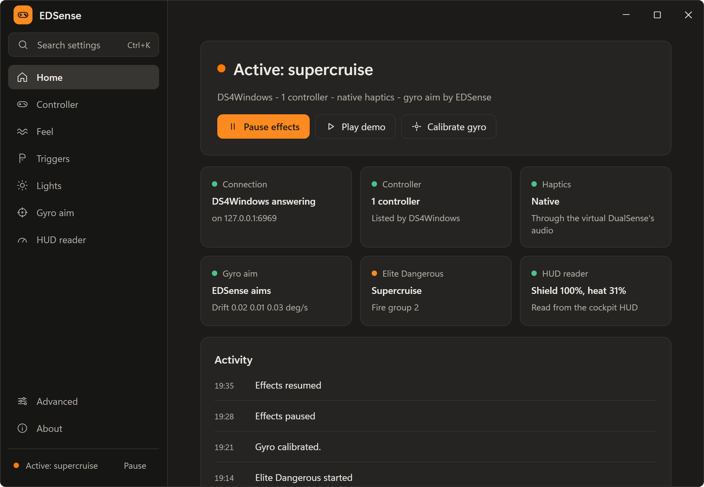
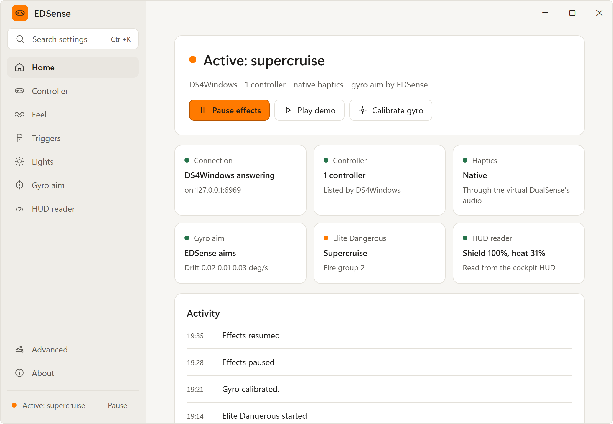

EDSense makes a PlayStation DualSense follow Elite Dangerous. The adaptive triggers, the lightbar, the LEDs, the haptics and the gyro aim change with what happens in the game. It is a free and open source Windows app that works through [DSX](https://github.com/Paliverse/DSX) or [DS4Windows 5](docs/ds4windows.md).

## Why EDSense

DSX (paid, on Steam) and DS4Windows 5 (free) make the DualSense work on PC. You set its triggers and lights in a profile, and they stay that way all game. EDSense keeps using the app you have: it follows Elite and tells that app what the controller should do, moment to moment.

| | DSX or DS4Windows alone | With EDSense |
|---|---|---|
| **Triggers** | The resistance you set, all game | A weapon click with hardpoints out, slack while all of a trigger's weapons reload, a shake while you are interdicted |
| **Lightbar** | The colour you set | Your hull from green to red, blue in supercruise, white while the FSD charges, red blinks with the shields down |
| **Player and mic LEDs** | What you set | Your fire group, a 5 -> 1 countdown through a jump, low fuel, silent running |
| **Haptics** | Only what the game itself sends | Its own feel for each weapon type, on the side of its trigger, and for hits, boost, heat, docking, planets and turns |
| **Gyro aim** | Moves the cursor in maps and menus too | Stops in panels, maps and station services, so the cursor stays still |

In the main menu, when Elite closes and when you pause or quit EDSense, the controller goes back to your own profile. Every effect, one by one: [What you feel](docs/feel.md).

## The app

 

The **Home** page shows what EDSense does now, with **Pause effects**, **Play demo** and **Calibrate gyro**. The **Controller** page checks how DSX or DS4Windows is set up and says what to fix. The window is light or dark as Windows is, or as you pick under **Advanced -> Appearance**. Closing it keeps EDSense running in the tray.

## Get started

You need Windows, Elite Dangerous, a DualSense or DualSense Edge, and DSX v3.1 or newer, or DS4Windows 5.

1. In DSX, open **Settings -> Networking** and turn on **Incoming UDP**. For DS4Windows, follow [its setup](docs/ds4windows.md#set-up-ds4windows).
2. Download the zip from the [latest release](https://github.com/tolgahan/ed-sense/releases/latest) and unzip it somewhere you can write to, such as Documents.
3. Run `EDSense.exe`. The first run asks which controller app you use and checks how it is set up. The exe is code-signed; if SmartScreen still warns, **More info** shows the verified publisher, then **Run anyway**.
4. With DSX, EDSense adds its "Elite Dangerous" profile to DSX. Press **Install...** in the first run's **Set it up** step or on the **Controller** page. After the first run, EDSense adds it by itself. Close DSX when EDSense asks (DSX tray icon -> **Exit**), and start it again once the profile is in.
5. Run Elite borderless or windowed, so EDSense can read the HUD. EDSense switches on by itself when you are in the game.

**Play demo** plays every effect once, without Elite. The full guide, also for starting with Windows and uninstalling: [Setup](docs/setup.md).

## What it touches

EDSense works from the files Elite writes for tools like EDMC (the journal and `Status.json`), your control bindings, and a HUD reader that reads shields, heat and fire groups from small parts of the Elite window. It does not read or write the game's memory or change the game's files. EDSense's gyro aim moves the mouse only while Elite is in front. Its only network traffic is UDP to DSX or DS4Windows on this PC, and it needs no admin rights. The full list: [How it works](docs/how-it-works.md#what-edsense-reads-and-writes).

## Docs

- [Setup](docs/setup.md): installing, DSX or DS4Windows, starting with Windows, uninstalling.
- [Using EDSense](docs/using.md): the window, the tray icon and menu, pausing, the demo and the gyro.
- [What you feel](docs/feel.md): every trigger, light and haptic effect, turns, jumps and gyro aim.
- [Settings](docs/settings.md): `edsense.json`, the command-line options, the DSX profile and DSX Native Mode.
- [DS4Windows](docs/ds4windows.md): EDSense with DS4Windows 5 in place of DSX.
- [Troubleshooting](docs/troubleshooting.md): what to check when something does not work.
- [How it works](docs/how-it-works.md): the HUD reader, what EDSense reads and writes, limits, checking a download, building from source.

## Disclaimer

EDSense is not affiliated with or endorsed by Frontier Developments, Paliverse (DSX), the DS4Windows project or Sony. Elite Dangerous is a trademark of Frontier Developments plc; DualSense is a trademark of Sony Interactive Entertainment.

EDSense is released under the MIT license. See [LICENSE](LICENSE).
