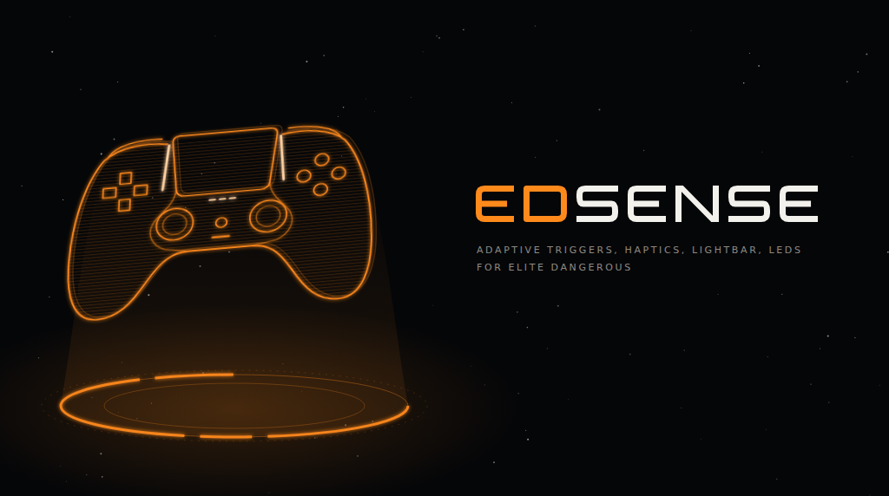

EDSense gives Elite Dangerous a DualSense feel through [DSX](https://github.com/Paliverse/DSX), or through [DS4Windows 5](docs/ds4windows.md). It follows the game: it sets the adaptive triggers, the lightbar and the LEDs, and plays haptics on the controller. It opens its window when you start it, and keeps running in the Windows tray when you close the window.

## What you feel

- **Triggers**: a weapon click on R2 and L2 with hardpoints out. A trigger goes slack while all its weapons reload, and both go slack when you fire with the weapons capacitor empty. These two need the HUD reader. They vibrate when you overheat with hardpoints out, buzz when you are attacked and shake while you are interdicted.
- **Lightbar**: your hull (green -> amber -> red), blue in supercruise, white while the FSD charges, red blinks with the shields down, orange when overheating.
- **LEDs**: the player LEDs show your fire group and count down 5 -> 1 through a hyperspace jump. The mic LED pulses on low fuel and stays on in silent running.
- **Haptics**: each weapon feels different, on the side of its trigger. EDSense reads which weapons each trigger fires from the HUD's fire group lists and remembers them for each fire group. Boost, heat, shield and hull hits, docking, planets and scans have their own feel too.
- **Turns and jumps**: by default, soft swells while the ship turns outside the throttle's blue zone, and one soft swell into the hyperspace tunnel. The FSD charge does not vibrate the triggers, and there is no thump when the jump starts.

Every effect, one by one: [docs/feel.md](docs/feel.md).

## Setup

You need Windows, Elite Dangerous, a DualSense or DualSense Edge, and DSX v3.1 or newer (tested with v3.2.0 BETA 02), or DS4Windows 5 ([with DS4Windows](#with-ds4windows)).

1. In DSX, open **Settings -> Networking** and turn on **Incoming UDP**.
2. Download the zip from the [latest release](https://github.com/tolgahan/ed-sense/releases/latest). Unzip the EDSense folder somewhere you can write to, such as Documents (not Program Files). EDSense keeps its settings and log next to the exe.
3. Run `EDSense.exe`. The exe is code-signed with a Certum certificate. The certificate is new, so Windows SmartScreen may still warn the first time: **More info** shows the verified publisher, then **Run anyway**.
4. EDSense adds an "Elite Dangerous" controller profile to DSX, with gyro aim, touchpad and triggers set up. DSX saves its profiles when it exits, so EDSense writes the profile only while DSX is closed. If DSX is running, close it when EDSense asks (DSX tray icon -> Exit). When EDSense says the profile is in DSX, start DSX again.
5. Run Elite in borderless or windowed mode, so EDSense can read the HUD. EDSense waits in the tray and switches on by itself when you are in the game.

If DSX already has a profile called "Elite Dangerous", EDSense leaves it alone. It also keeps any profile you already set for Elite in DSX. **Reset DSX profile...** in the tray menu puts the bundled profile in place, backs up the old one and sets it for Elite. If you keep your own profile, it needs at least **DualSense Emulation** as its virtual device. The full checklist is in [docs/settings.md](docs/settings.md#dsx-profile).

To start EDSense with Windows, put a shortcut to `EDSense.exe` in your Startup folder (Win+R, `shell:startup`), and add ` -tray` at the end of the shortcut's **Target**, so it starts in the tray without opening its window. A shortcut you made for an older version needs the same ` -tray`, or the window now opens at every sign-in.

### With DS4Windows

EDSense also works with DS4Windows 5 in place of DSX: its game mod support takes the triggers and lights, and its virtual DualSense the haptics and the gyro. Tray -> **Controller app -> DS4Windows** (or `"backend": "ds4windows"` in `edsense.json`), then restart EDSense. With **Auto**, EDSense uses the one that runs. The DS4Windows settings, the profile and the gyro rules are in [docs/ds4windows.md](docs/ds4windows.md).

## Tray menu and window

The icon is orange while EDSense drives the controller. It is grey while EDSense waits for Elite, while you are in the main menu and while it is paused. It is red when DSX (or DS4Windows) does not answer.

EDSense opens its window when you start it (not with `-tray`). Click the icon to open the window again; right-click it for the menu. Starting `EDSense.exe` again while it runs also opens the window.

- **Open EDSense**: opens the window. Its Home page shows what EDSense does now, the controller app, the controller, the haptics, the gyro, Elite and the HUD reader, and what happened lately. While the window is open or opening, messages EDSense would show in a box appear there instead. It has **Pause effects**, **Play demo** and **Calibrate gyro**. About shows the version and whether the exe's signature is valid. The other pages come in later versions: until then their settings are in `edsense.json`. Closing the window keeps EDSense running in the tray.
- **Pause effects**: gives the controller back to your DSX (or DS4Windows) profile until you untick it.
- **Play demo**: plays every effect once. Elite does not need to run.
- **Gyro aim**: untick it to fly with the sticks only.
- **EDSense gyro**: ticked, EDSense turns the controller's motion into mouse movement for Elite; unticked, DSX does, as before. Both feel the same by default. EDSense only takes over motion to mouse, as in the bundled DSX profile: a gyro set to a stick or keys in DSX is left alone.
- **Calibrate gyro...**: teaches EDSense the controller's drift. With Elite running, put the controller down, press Yes and leave it for 2 seconds. EDSense also does this by itself whenever the controller lies still.
- **Open settings**: opens `edsense.json` in Notepad. Most changes apply about 2 s after you save.
- **Open log**: opens `edsense.log`. Look here first when something does not work.
- **Controller app**: **Auto**, **DSX** or **DS4Windows**, the `backend` setting. It applies from the next start.
- **Reset DSX profile...**: puts the bundled "Elite Dangerous" profile back in DSX. Yours is backed up. Shown only with DSX.
- **Quit**: gives the controller back and closes EDSense.

The controller also goes back to your DSX profile in the main menu and when Elite closes.

The window needs Microsoft's WebView2 Runtime, which comes with Windows 11 and nearly every Windows 10 PC. If it is missing, EDSense offers to open Microsoft's download page (it never downloads anything itself), and the tray menu keeps working without the window.

## Turn and jump feel

Two settings in `edsense.json` (tray -> **Open settings**) choose how turns and jumps feel. EDSense picks up a change while it runs.

- `turn_feel`: `"waves"` (default) is a soft swell about every 2 seconds while the ship turns, stronger the harder you turn. `"push"` is a soft push when a turn starts, changes or ends, and quiet while it holds. `"off"` turns it off.
- `jump_feel`: `"swell"` (default) is one soft swell into the hyperspace tunnel. `"calm"` adds a soft pulse every second while the FSD charges. `"off"` turns it off.

To make a feel weaker without turning it off, lower its level under `haptics_gain`: `maneuver` for turns, `hyperspace` for the jump swell, `fsd_charge` for the calm pulse. 1 is normal, 0.5 is half.

To compare the feels without flying, close Elite, open PowerShell in the EDSense folder and run `.\EDSense.exe -feeltest`. It plays four plain tones, then each turn feel and each jump feel, in about a minute.

- Turns are felt only outside the throttle's blue zone, and never in the hyperspace tunnel. The blue zone comes from the HUD reader: without it, turns are felt everywhere.
- With gyro aim on and Elite's **Relative Mouse** off (no mouse decay), a controller held tilted keeps the ship turning. The turn feel stays until you turn the controller back or press the mouse reset key. EDSense can only estimate Elite's mouse stick, so a held turn fades out over about a minute.
- While a finger rests on the touchpad (DSX's gyro pause) or mouse headlook is on, moving the controller turns nothing. A turn you already hold goes on.

More about turns, jumps and the gyro: [docs/feel.md](docs/feel.md#turns).

## What EDSense touches

- It reads the journal and `Status.json` (the files Elite writes for tools like EDMC and EDDI), your control bindings and your HUD colour settings. It does not read or write the game's memory or change the game's files.
- With EDSense's gyro it moves the mouse through Windows, as DSX's gyro does, only while Elite is in front and you are not in a menu.
- The HUD reader captures small parts of the Elite window, only while Elite is in front and you are in the cockpit. Captures are read in memory and dropped, unless you turn on `hud_debug`. `"hud_reader": false` turns the HUD reader off.
- It reads only the keys bound to a few actions (heat sink, chaff, shield cell, boost, mouse reset, head look, and your modifier keys), and only while Elite is in front. Nothing is stored or sent.
- Its only network traffic is UDP to DSX or DS4Windows on this PC (`127.0.0.1`). It sends nothing to the internet. The window's page is inside the exe and fetches nothing from the internet; the links on its About page open in your browser when you click them.
- It runs as your user and needs no admin rights. The exe is code-signed, and each release has a `SHA256SUMS.txt` file and a build provenance attestation to check the download: [docs/how-it-works.md](docs/how-it-works.md#checking-a-download).

The full list of what it reads and writes: [docs/how-it-works.md](docs/how-it-works.md#what-edsense-reads-and-writes).

## If something does not work

Open the log first (tray -> **Open log**). It says what EDSense found and what is missing.

- **Red tray icon**: DSX is closed, or Incoming UDP is off. With DS4Windows: [docs/ds4windows.md](docs/ds4windows.md#when-something-does-not-work).
- **No haptics**: the DSX profile needs **DualSense Emulation**. `.\EDSense.exe -padtest` and `.\EDSense.exe -hapticstest` check it.
- **Turns felt in the blue zone, or no shield and heat effects**: run Elite borderless or windowed.
- **Heat sink, chaff, shield cell or boost not felt**: EDSense needs a custom control preset. Change any binding in Elite once and Elite saves one.
- **A feel is too much**: set `"turn_feel": "push"` or `"off"`, `"jump_feel": "off"`, or a lower `maneuver` in `haptics_gain`.
- **The ship turns by itself with the controller on the desk**: tray -> **Calibrate gyro...**.
- **Gyro aim does nothing, or moves twice as far**: look for lines starting with `Gyro:` in the log, and run `.\EDSense.exe -gyrotest`. Unticking **EDSense gyro** gives you DSX's gyro back.

More fixes: [docs/settings.md](docs/settings.md#when-something-does-not-work).

## Uninstall

1. Tray menu -> **Quit**.
2. Delete the EDSense folder, and `%APPDATA%\EDSense` if it exists. The window keeps a cache in `%LOCALAPPDATA%\EDSense`: delete that too.
3. Delete your Startup shortcut if you made one. Versions up to 0.4.2 could add themselves to startup: turn that off in **Task Manager -> Startup apps**.
4. If you like, delete the "Elite Dangerous" profile in DSX.

## More

- [What you feel](docs/feel.md): every trigger, light and haptic effect, turns, jumps and the gyro.
- [Settings](docs/settings.md): `edsense.json`, command-line options, the DSX profile, DSX Native Mode, troubleshooting.
- [DS4Windows](docs/ds4windows.md): EDSense with DS4Windows 5 in place of DSX: its settings, the profile, the gyro, the keys `backend`, `ds4windows_port` and `ds4windows_haptics`.
- [How it works](docs/how-it-works.md): the HUD reader, what EDSense reads and writes, limits, building from source.

## Disclaimer

EDSense is not affiliated with or endorsed by Frontier Developments, Paliverse (DSX), the DS4Windows project or Sony. Elite Dangerous is a trademark of Frontier Developments plc; DualSense is a trademark of Sony Interactive Entertainment.

EDSense is released under the MIT license. See [LICENSE](LICENSE).
